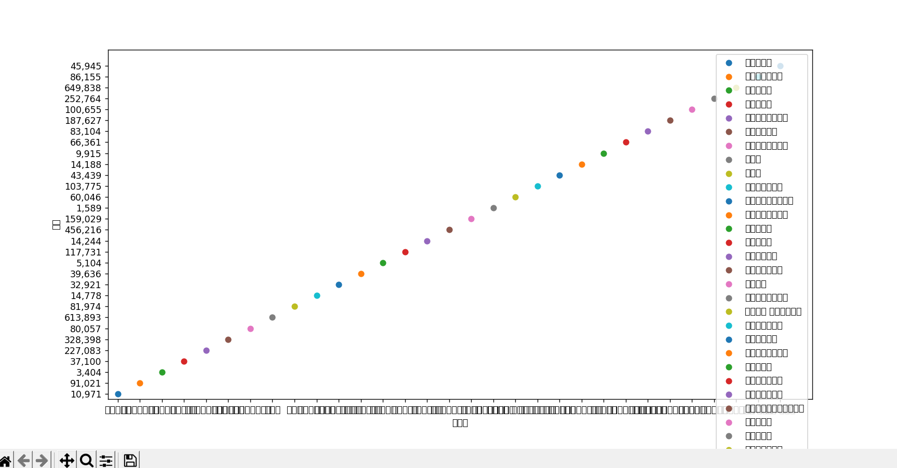
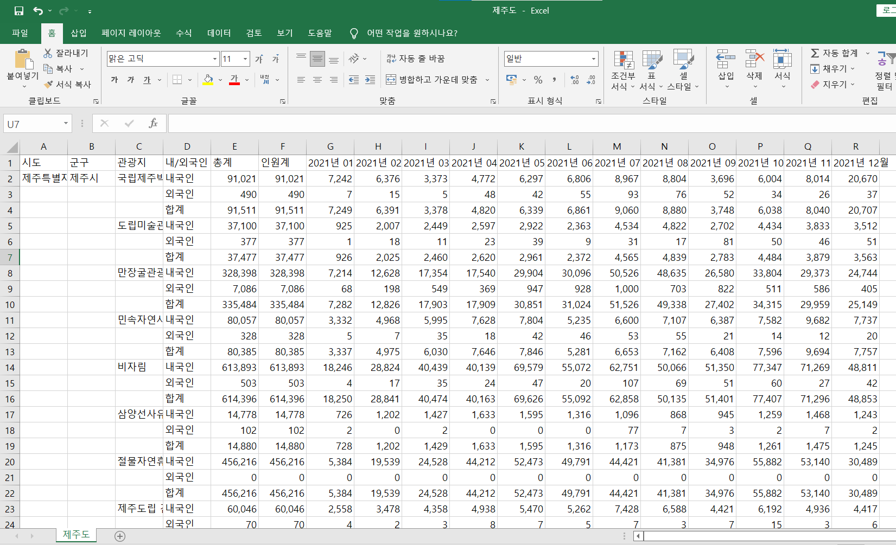

## What happend?
---

I faced on hard problem in this Project.  
I want Data visualization through csv file.  
So, I tied to read csv file on python by *pandas* 
<br>
<br>
First, Download dataSet at [관광지식정보시스템](https://know.tour.go.kr/stat/visitStatDis/table.do)  
It's name : **'주요관광지점 입장객(2004.07 이후)_220401051456.xls'**  
I wrote a few lines of code to check the dataSet.
<br>
```py
from base64 import decode, encode
import pandas as pd
import matplotlib.pyplot as plt

csv_data = pd.read_csv("제주도.csv", engine="python", encoding="utf-8")

sorted = csv_data.sort_values(by="총계")

#   print(sorted.head())

# 그래프 사이즈 지정하기
plt.figure(figsize=(14, 7))
# day로 그룹화하여 모든 그룹에 반복하기
for name, group in sorted.groupby("관광지"):
    # 각 그룹에 맞게 점 그리기
    plt.scatter(group["관광지"], group["총계"], label=name)
# 축 이름 지정하기
plt.xlabel("관광지")
plt.ylabel("총계")
# 범례 추가
plt.legend()
plt.show()
```  

But, run that code then,  
  
<br>

So, I tried to change dataSet
1. .xls to .csv (utf-8)
2. follow [This link](https://teddylee777.github.io/pandas/%EA%B3%B5%EA%B3%B5%EB%8D%B0%EC%9D%B4%ED%84%B0-%ED%95%9C%EA%B8%80%EA%B9%A8%EC%A7%90%ED%98%84%EC%83%81-%ED%95%B4%EA%B2%B0%EB%B0%A9%EB%B2%95)  

Final dataSet  

<br>

But I got the same result as before.
<br>

## Please Help me...